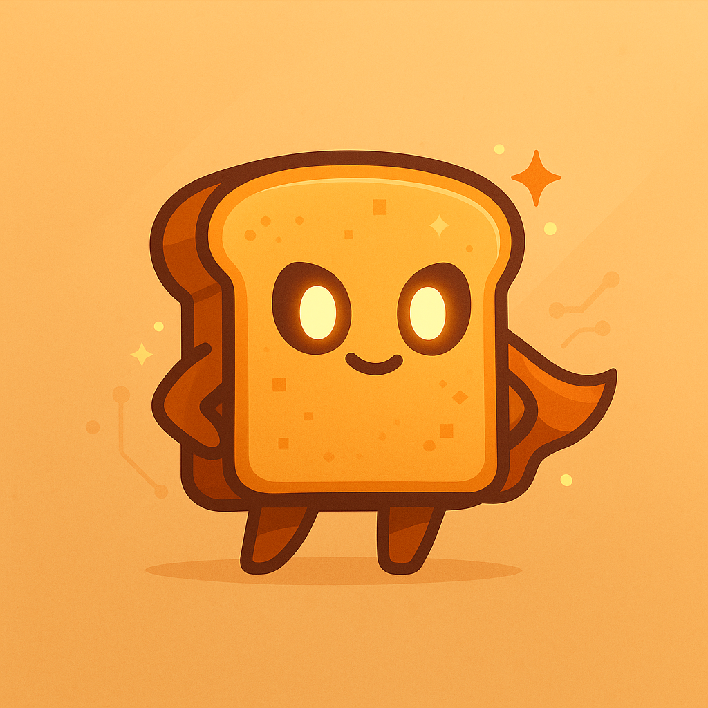

# 🍞 rn-tosty

<div align="center">
  
</div>

**The most delicious toast notifications for React Native**

<div align="center">

[](https://badge.fury.io/js/rn-tosty)
[](https://www.npmjs.com/package/rn-tosty)
[](https://github.com/Codestz/rn-tosty/blob/main/LICENSE)
[](http://www.typescriptlang.org/)

</div>

---

## 🌟 Why rn-tosty?

**Because your users deserve better than boring notifications.**

Imagine this: Your user just completed a purchase, uploaded a photo, or finished a workout. Instead of a plain, lifeless toast that barely catches their attention, they see a **beautiful, themed notification** that perfectly matches your app's personality – complete with smooth animations, smart positioning, and delightful interactions.

That's rn-tosty. **Toast notifications that actually make users smile.**

### 🎯 Built for the Real World

- **🚀 One Line of Code**: `toast.success('Done!')` – seriously, that's it
- **🎨 4 Stunning Themes**: From warm sunsets to ocean breezes, each with unique personality
- **📱 Device-Smart**: Automatically avoids notches, Dynamic Island, and punch-holes
- **⚡ Lightning Fast**: 60fps animations that feel native and responsive
- **🧠 Actually Intelligent**: Smart queuing, priority handling, and duplicate detection
- **♿ Inclusive by Design**: WCAG 2.1 AA compliant with screen reader support
- **🛡️ Production Battle-Tested**: Error boundaries, crash protection, and comprehensive logging

### 💫 The Magic is in the Details

```tsx
// This simple call creates magic ✨
toast.promise(saveUserProfile(), {
  loading: 'Saving your profile...',
  success: (data) => `Welcome back, ${data.name}!`,
  error: 'Oops! Something went wrong',
});
```

**What happens behind the scenes:**

- Beautiful loading animation appears instantly
- Smart positioning avoids your device's notch
- Progress bar shows exactly how much time is left
- Seamless transition to success with user's name
- Theme colors automatically match your app
- Screen reader announces the result
- Queue manages multiple toasts intelligently
- Error boundary protects your app if something breaks

**All from one simple function call.**

## 🎉 What Makes It Special?

### 🎨 **Themes That Tell Stories**

Not just "light" and "dark" – we're talking **warm sunset** vibes for cozy apps, **ocean breeze** calm for wellness apps, and **forest glow** earthiness for outdoor adventures. Each theme has its own personality, animations, and color psychology.

### 🧠 **Stupidly Smart**

- **Auto-positioning**: Knows about iPhone notches, Dynamic Island, Android punch-holes
- **Smart queuing**: Prevents notification spam while prioritizing important messages
- **Duplicate detection**: "Uploading photo..." won't show 5 times
- **Promise awareness**: Loading → Success/Error transitions feel magical

### 🚀 **Developer Experience That Sparks Joy**

```tsx
// Want to show success? One line:
toast.success('User created!');

// Want loading states? Still one line:
toast.promise(api.createUser(), {
  loading: 'Creating user...',
  success: 'User created successfully!',
  error: 'Failed to create user'
});

// Want custom themes? You got it:
<ToastProvider theme="warmSunset">
```

### 💪 **Production-Grade Everything**

Built by a developer who've shipped apps to millions of users. Every edge case handled, every performance detail optimized, every accessibility standard met.

## 📚 Documentation

**[📖 Complete Documentation](https://codestz.github.io/rn-tosty/)** • **[🚀 Quick Start](https://codestz.github.io/rn-tosty/docs/intro)** •

## 🚀 Installation

```bash
npm install rn-tosty
# or
yarn add rn-tosty
```

### Required Dependencies

```bash
npm install react-native-reanimated react-native-safe-area-context react-native-device-info react-native-svg
```

> **Note**: `react-native-safe-area-context` is a peer dependency to avoid conflicts with apps that already use it.

## 🎯 Quick Start

### 1. Setup Provider

Wrap your app with `ToastProvider`:

```tsx
import React from 'react';
import { SafeAreaProvider } from 'react-native-safe-area-context';
import { ToastProvider, Themes } from 'rn-tosty';

export default function App() {
  return (
    <SafeAreaProvider>
      <ToastProvider theme="default">
        <YourApp />
      </ToastProvider>
    </SafeAreaProvider>
  );
}
```

### 2. Use Toast API

```tsx
import { toast } from 'rn-tosty';

// Simple usage
toast.success('Profile updated successfully!');
toast.error('Something went wrong!');
toast.info('New message received');
toast.warning('Your session will expire soon');

// With configuration
toast.success('Payment successful!', {
  duration: 5000,
  position: 'bottom',
});

// Custom toast
toast.custom({
  message: 'Custom notification',
  type: 'info',
  variant: 'default',
});
```

### 3. Use React Hook (Alternative)

```tsx
import { useTosty } from 'rn-tosty';

function MyComponent() {
  const { success, error, info, warning } = useTosty();

  const handleSave = () => {
    success('Data saved successfully!');
  };

  return <Button title="Save" onPress={handleSave} />;
}
```

## 🎨 Theme System

rn-tosty comes with 4 beautiful preset themes that automatically support light and dark modes:

### Available Themes

| Theme         | Description                                 | Best For                |
| ------------- | ------------------------------------------- | ----------------------- |
| `default`     | Clean, contemporary design                  | Most applications       |
| `warmSunset`  | Cozy sunset colors with warm gradients      | Social, lifestyle apps  |
| `oceanBreeze` | Calming ocean blues with flowing animations | Health, meditation apps |
| `forestGlow`  | Earthy forest greens with organic styling   | Nature, outdoor apps    |

### Using Themes

```tsx
import { ToastProvider, Themes } from 'rn-tosty';

// Set theme at provider level
<ToastProvider theme="warmSunset">
  <App />
</ToastProvider>

// Or use theme objects
<ToastProvider theme={Themes.oceanBreeze}>
  <App />
</ToastProvider>

// With explicit mode
<ToastProvider
  theme="forestGlow"
  initialMode="dark"
  followSystemAppearance={true}
>
  <App />
</ToastProvider>
```

### Dynamic Theme Switching

```tsx
import { useTheme } from 'rn-tosty';

function ThemeSelector() {
  const { setTheme, setMode, toggle, currentTheme } = useTheme();

  return (
    <View>
      <Button title="Ocean Breeze" onPress={() => setTheme('oceanBreeze')} />
      <Button title="Toggle Mode" onPress={toggle} />
      <Text>Current: {currentTheme.name}</Text>
    </View>
  );
}
```

## ⚡ Promise Integration

Handle async operations with built-in loading states:

```tsx
import { toast } from 'rn-tosty';

// Basic promise handling
const saveData = async () => {
  const promise = api.saveUserProfile(data);

  return toast.promise(promise, {
    loading: 'Saving your profile...',
    success: 'Profile saved successfully!',
    error: 'Failed to save profile',
  });
};

// Advanced promise configuration
toast.promise(
  fetchUserData(),
  {
    loading: {
      message: 'Loading user data...',
      icon: { type: 'spinner', size: 'large' },
    },
    success: (data) => `Welcome back, ${data.name}!`,
    error: (error) => `Error: ${error.message}`,
  },
  {
    position: 'top',
    layout: { iconPosition: 'right' },
  }
);
```

## 🏃‍♂️ Queue Management

Smart queue system with priority handling and overflow strategies:

```tsx
import { ToastProvider, QueuePresets } from 'rn-tosty';

<ToastProvider
  config={{
    queue: QueuePresets.default(), // or conservative(), aggressive(), etc.
    maxToasts: 5,
  }}
>
  <App />
</ToastProvider>;

// Show toasts with priorities
toast.error('Critical error!', { priority: 'urgent' });
toast.info('Background task completed', { priority: 'low' });
toast.success('Payment successful', { priority: 'high' });
```

### Queue Presets

- `QueuePresets.default()` - Balanced for most apps
- `QueuePresets.conservative()` - Fewer toasts, avoid overwhelming
- `QueuePresets.aggressive()` - More toasts, faster display
- `QueuePresets.simple()` - FIFO without priority ordering
- `QueuePresets.immediate()` - No queuing, immediate display only

## 🎛️ Configuration

### Provider Configuration

```tsx
import {
  ToastProvider,
  QueuePresets,
  VerticalOffsetPresets,
  ToastLayoutPresets,
} from 'rn-tosty';

<ToastProvider
  theme="warmSunset"
  initialMode="auto"
  followSystemAppearance={true}
  config={{
    // Basic settings
    maxToasts: 3,
    defaultDuration: 4000,
    defaultPosition: 'top',
    defaultVariant: 'default',

    // Queue management
    queue: QueuePresets.conservative(),

    // Layout and positioning
    layout: ToastLayoutPresets.balanced(),
    verticalOffset: VerticalOffsetPresets.safe(),

    // Progress bars
    progressBar: {
      enabled: true,
      position: 'bottom',
      height: 3,
      showForTypes: {
        success: true,
        error: true,
        warning: true,
        info: true,
        custom: true,
      },
      animation: {
        duration: 100,
        easing: 'ease-out',
      },
    },

    // Accessibility
    accessibility: {
      enabled: true,
      announceMode: 'auto',
      customLabels: {
        success: 'Success',
        error: 'Error',
        warning: 'Warning',
        info: 'Information',
      },
      customHints: {
        dismissible: 'Tap to dismiss',
        autoDismiss: 'Will auto-dismiss',
        permanent: 'Tap to dismiss',
      },
      includeTypeInLabel: true,
      includeDurationInHint: false,
    },
  }}
>
  <App />
</ToastProvider>;
```

### Per-Toast Configuration

```tsx
toast.success('Operation completed!', {
  variant: 'success',
  duration: 6000,
  position: 'bottom',
  priority: 'high',
  layout: {
    iconPosition: 'right',
    textAlignment: 'center',
    spacing: 'spacious',
  },
  progressBar: {
    enabled: true,
    position: 'top',
    color: '#10B981',
    height: 3,
  },
});
```

## 📱 Safe Area & Positioning

Automatic device detection and smart positioning:

```tsx
import { VerticalOffsetPresets } from 'rn-tosty';

<ToastProvider
  config={{
    // Automatic device adaptation (default)
    verticalOffset: VerticalOffsetPresets.safe(),

    // Custom spacing
    verticalOffset: {
      top: 20,           // Extra space from top
      bottom: 10,        // Extra space from bottom
      global: 5,         // Applied to both
      adaptToDevice: true, // Smart device handling
      minMargin: 16,     // Minimum safe margin
      maxMargin: 60,     // Maximum margin cap
    },
  }}
>
```

### Positioning Presets

- `VerticalOffsetPresets.default()` - Automatic adaptation
- `VerticalOffsetPresets.spacious()` - Extra breathing room
- `VerticalOffsetPresets.compact()` - Reduced margins
- `VerticalOffsetPresets.avoidTop(30)` - Avoid navigation bars
- `VerticalOffsetPresets.avoidBottom(60)` - Avoid tab bars
- `VerticalOffsetPresets.tablet()` - Optimized for tablets

## 🎯 Custom Variants

Create your own toast variants:

```tsx
import { variants } from 'rn-tosty';

// Register a custom variant
variants.register({
  name: 'brand-success',
  displayName: 'Brand Success',
  description: 'Success variant with brand colors',
  theme: {
    light: {
      name: 'brand-success-light',
      mode: 'light',
      colors: {
        primary: '#FF6B6B',
        surface: '#FFF5F5',
        onSurface: '#C53030',
        // ... other theme properties
      },
      // ... rest of theme configuration
    },
    dark: {
      // ... dark variant
    },
  },
});

// Use custom variant
toast.success('Success!', { variant: 'brand-success' });
```

## ♿ Accessibility

Full accessibility support with configurable behavior:

```tsx
<ToastProvider
  config={{
    accessibility: {
      enabled: true,
      announceMode: 'auto', // 'auto', 'assertive', 'polite'
      customLabels: {
        success: 'Success',
        error: 'Error',
        warning: 'Warning',
        info: 'Information',
      },
      customHints: {
        dismissible: 'Tap to dismiss',
        autoDismiss: 'Will auto-dismiss',
        permanent: 'Tap to dismiss',
      },
      includeTypeInLabel: true,
      includeDurationInHint: false,
    },
  }}
>
```

## 📊 API Reference

### Toast Methods

```tsx
// Basic methods
toast.success(message: string, config?: MethodToastConfig): string
toast.error(message: string, config?: MethodToastConfig): string
toast.info(message: string, config?: MethodToastConfig): string
toast.warning(message: string, config?: MethodToastConfig): string
toast.custom(config: ToastConfig): string

// Utility methods
toast.dismiss(id?: string): void
toast.getQueueStats(): { visible: number; queued: number; total: number }

// Promise method
toast.promise<T>(
  promise: Promise<T>,
  messages: PromiseMessages<T>,
  config?: PromiseConfig
): Promise<T>
```

### Hook API

```tsx
const {
  success,
  error,
  info,
  warning,
  custom,
  dismiss,
  promise,
  getQueueStats,
  theme: { current, setMode, setTheme, toggle },
} = useTosty();
```

### Theme Management

```tsx
const {
  currentTheme,
  themeName,
  themeMode,
  setMode,
  setTheme,
  toggle,
  isDark,
  isLight,
  isAuto,
} = useTheme();
```

## 🔧 Advanced Usage

### Custom Icons

```tsx
const CustomIcon = ({ size, color }) => (
  <YourIconComponent size={size} color={color} />
);

toast.success('Custom icon!', {
  icon: CustomIcon,
});
```

### Progress Bar Customization

```tsx
toast.success('With progress', {
  duration: 8000,
  progressBar: {
    enabled: true,
    position: 'bottom',
    color: '#10B981',
    height: 4,
  },
});

// Using progress bar presets
import { ProgressBarPresets } from 'rn-tosty';

<ToastProvider
  config={{
    progressBar: ProgressBarPresets.thick(), // or smooth(), fast(), minimal(), etc.
  }}
>
```

### Layout Presets

```tsx
import { ToastLayoutPresets } from 'rn-tosty';

// Use layout presets
toast.info('Centered layout', {
  layout: ToastLayoutPresets.centered(),
});

// Available presets:
// - balanced() - Default balanced layout
// - centered() - Center-aligned text and icon
// - minimal() - Compact spacing
// - spacious() - Extra breathing room
// - rightAligned() - Right-aligned content
```

## 🎨 Icons & Loading Animations

### Icon System

rn-tosty comes with built-in icons for all toast types and supports custom icons:

```tsx
import { toast, IconPresets } from 'rn-tosty';

// Using built-in icons (default)
toast.success('Built-in success icon');

// Using icon presets
<ToastProvider
  config={{
    icons: IconPresets.large(), // or minimal(), static()
  }}
>

// Custom icon configuration
<ToastProvider
  config={{
    icons: {
      defaultSize: 'medium',
      defaultAnimated: true,
      success: {
        component: MyCustomSuccessIcon,
        size: 'large',
        color: '#10B981',
        animated: true,
      },
      error: {
        component: MyCustomErrorIcon,
        size: 24,
        color: '#EF4444',
      },
    },
  }}
>
```

### Custom Icon Components

Create your own icon components:

```tsx
import { CustomIconComponent } from 'rn-tosty';

const MyCustomIcon: CustomIconComponent = ({ size, color, theme }) => (
  <View style={{ width: size, height: size }}>
    <YourIconComponent size={size} color={color} />
  </View>
);

// Use in specific toast
toast.success('Custom icon!', {
  icon: MyCustomIcon
});

// Or configure globally
<ToastProvider
  config={{
    icons: {
      success: { component: MyCustomIcon },
    },
  }}
>
```

### Vector Icons Support

```tsx
import { createVectorIcon } from 'rn-tosty';
import Icon from 'react-native-vector-icons/MaterialIcons';

// Create vector icon wrapper
const CheckIcon = createVectorIcon(Icon, 'check-circle');
const ErrorIcon = createVectorIcon(Icon, 'error');

<ToastProvider
  config={{
    icons: {
      iconSet: {
        success: CheckIcon,
        error: ErrorIcon,
        warning: createVectorIcon(Icon, 'warning'),
        info: createVectorIcon(Icon, 'info'),
      },
    },
  }}
>
```

### Icon Presets

```tsx
import { IconPresets } from 'rn-tosty';

// Available presets:
IconPresets.default(); // Medium size, animated
IconPresets.large(); // Large icons for better visibility
IconPresets.minimal(); // Small, static icons
IconPresets.static(); // No animations for performance
```

### Loading Icons

For promise-based toasts, rn-tosty includes beautiful loading animations:

```tsx
// Built-in loading animations
toast.promise(apiCall(), {
  loading: {
    message: 'Processing...',
    icon: { type: 'spinner' }, // 'spinner', 'dots', 'bars', 'pulse'
  },
  success: 'Done!',
  error: 'Failed!',
});

// Advanced loading icon configuration
toast.promise(apiCall(), {
  loading: {
    message: 'Loading data...',
    icon: {
      type: 'bars',
      size: 'large', // 'small', 'medium', 'large', or number
      color: '#3B82F6', // Custom color
      animated: true, // Enable/disable animation
    },
  },
  success: (data) => `Loaded ${data.length} items`,
  error: 'Loading failed',
});

// Loading icon types:
// - 'spinner': Classic spinning circle
// - 'dots': Three bouncing dots
// - 'bars': Animated bars (equalizer style)
// - 'pulse': Pulsing circle
```

### Loading Icon Transitions

Loading icons can smoothly transition to success/error states:

```tsx
// The loading icon will transition to a success checkmark or error X
toast.promise(apiCall(), {
  loading: {
    message: 'Saving...',
    icon: {
      type: 'pulse',
      // Smooth transition to success/error icons
    },
  },
  success: 'Saved successfully!',
  error: 'Save failed',
});
```

## 🛡️ Error Boundary

rn-tosty includes a built-in error boundary that gracefully handles component errors:

### Automatic Error Handling

The error boundary is automatically applied to all toast components:

```tsx
// If a toast component crashes, users see a fallback instead of a blank screen
toast.success('This toast is protected by error boundary');
```

### Error Boundary Features

- **Graceful Fallback**: Shows a minimal error toast instead of crashing
- **Error Logging**: Automatically logs errors for debugging
- **Crash Reporting**: Easy integration with services like Crashlytics
- **Custom Fallback UI**: Provide your own error display
- **Production Safe**: Errors don't break the entire app

### Error Fallback Styling

The default error fallback can be customized:

```tsx
<ToastErrorBoundary
  fallback={
    <View style={myCustomErrorStyles}>
      <Text>Oops! Something went wrong</Text>
      <Button title="Retry" onPress={handleRetry} />
    </View>
  }
>
```

### Development vs Production

In development, you'll see detailed error information. In production, users see a clean fallback UI while errors are logged for debugging.

## 🛠️ Requirements

### Peer Dependencies

- `react`: ^18.0.0 || ^19.0.0
- `react-native`: ^0.70.0
- `react-native-reanimated`: >=3.0.0
- `react-native-safe-area-context`: >=4.0.0
- `react-native-device-info`: >=10.0.0
- `react-native-svg`: >=13.0.0

### Platform Support

- ✅ iOS 11.0+
- ✅ Android API level 21+
- ✅ All screen types (notch, Dynamic Island, punch-hole)
- ✅ Tablets and large screens
- ✅ RTL language support

## 📄 License

MIT © [Codestz](https://github.com/Codestz)

## 🤝 Contributing

Contributions are welcome! Please read our [contributing guidelines](CONTRIBUTING.md) and [code of conduct](CODE_OF_CONDUCT.md).

## 📚 Examples

Check out the [example app](./example) for a complete implementation showcasing all features.

---

**Made with ❤️ for the React Native community**
